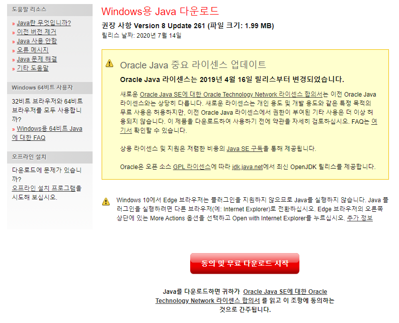
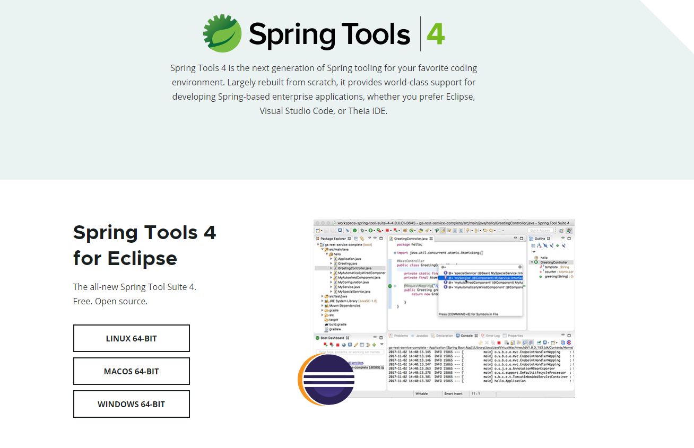
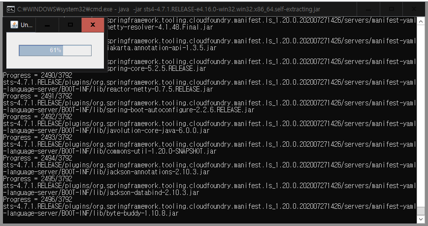
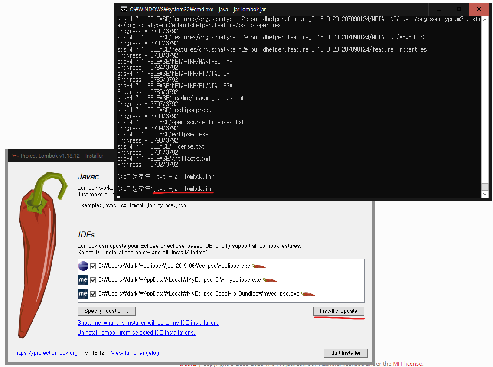

검침&모뎀 관리 프로그램
======================
해당 모듈은 검침 관리 프로그램(COAP)과 모뎀 관리 프로그램(OBJECT)를 병행 개발 가능한 클라이언트 모듈입니니다.

> **필자가 전하는말:**

>- 사람이 개발하는것이기에 로봇도 아니고 항상 100% 완벽한 통일성을 보장할 수는 없습니다. 그래도 코드를 최대한 맞춰서 작업을 해야한다고 판단되는 부분입니다.
>- 필자가 100% 정답이라고 볼 수는 없습니다. 단지, 아래의 규칙 기준하에 개발되었다는 기준으로 문서를 참고하면 참고하시기 바랍니다.
>- 하기에 작성된 개발규칙들은 코드를 최소한으로 정규화 시키기위함으로 바라봐주셨으면 좋겠습니다.
>- 필자 역시 최대한 아래와 같은 규칙들을 지키려고 노력할 것이고 놓칠수도 있습니다. **비판은 할수 있되 비난은 자제** 부탁드리며 글을 마칩니다.   pblee@cnuglobal.com
>- **본글을 메모장 및 기타 프로그램에 열으셨다면 https://stackedit.io/editor 에다가 복사 붙여넣기 하여 읽으시길 바랍니다.**
---

## 개발환경 구축
### 기본 환경
>- 이클립스 : STS4-4.7.1.RELEASE (이상)
>- JAVA : 1.8 이상 (Version 8 Update 261)
>- LOMBOK : 1.18.12 이상
>- MAVEN : 2.x 이상 (이클립스 내장탑재)
>- 필수 LIB : Spring boot Starter, leshan-client-cf, gson, lombok (MAVEN으로 대체)
### 설치 방법
>- **JAVA** : [JAVA8 다운로드](https://www.java.com/ko/download/win10.jsp)
>>- JAVA Dev 환경은 무료배포이므로 유무료 여부를 따지지 않고 개발해도 무방하다.
>>
>
>- **이클립스** : [이클립스 다운로드](https://spring.io/tools#main) 사이트에서 개발환경에 맞게 다운로드
>>
>>- jar파일이 배포되는데 이를 명령창에서 **java -jar [파일명]** 을 통해서 실행하면 자동 압축 해제를 진행한다.
>>
>
>- **lombok** : [LOMBOK 다운로드](https://projectlombok.org/download) 명령창에서 **java -jar [파일명]** 을 사용하면된다.
>>- lombok은 VO Object에 대한 개발 편리성을 높인 코드이다.
>>

---

## Code Rule (Common)
- 과도한 칸띄움은 지양한다.
  ```java
  for ( int i = 0 ; i < 2 ; i++ ) {}	// (x)
  for (int i=0 ; i<2; i++) {}	// (o)
  ```
- 줄띄움은 다음과 같은 사항이 아니면 사용하지 않되 가독성이 심하게 떨어지는 경우엔 구분해주어 사용한다.
  ```
  a. 함수와 함수간인 경우
  b. 흐름제어문 (if, for, while, try 등)의 사용
  c. return 사용
  ```
- 한줄 코드는 가독성을 낮추므로 자제해야한다. (단 라이브러리 성향을 지닌 고정적인 코드들은 상관없다)
  ```javascript
  if (n > 0) break; (x)
  if (n > 0) {break;} (x)
  if (n > 0) {      (o)
      break;	  
  }
  ```
- 3항 연산자는 사용하지 않는다.
  ```
  return n.length >= width ? n : new Array(width - n.length + 1).join('0') + n; (x)
  ```
	
---

## Code Rule (JAVA)
- 클래스명을 제외한 모든 표기는 Camel표기법으로 통일한다. (접두어, 접미어에 약어가 들어가는 경우엔 개인판단에 맡긴다.)
- MVC패턴으로 개발을 하되 service 단에서 단위기능 코드는 service.bizproc에 넣고 사용한다. (결합도를 낮추면서 재사용성을 높이는 방식 --> 본소스에서는 CRUD중 CUD를 거의 사용않기 때문에 들어가는 경우가 적은편이다.)
- Controller : 로직에 관한 모든 부분은 서비스에게 맡기되 컨트롤러가 해야할 역할인 Parameter getting하는데 있어서 부득이하게 로직이 들어가야할 경우 AbsController를 이용한다.
- 변수 선언시 접두어를 사용하지 않는다.
  ```java
  int nCount; (x)
  int count; (o)
  ```
- 변수명은 약어 사용을 지양한다.
  ```java
  int cnt; (x)
  int count; (o)
  ```
